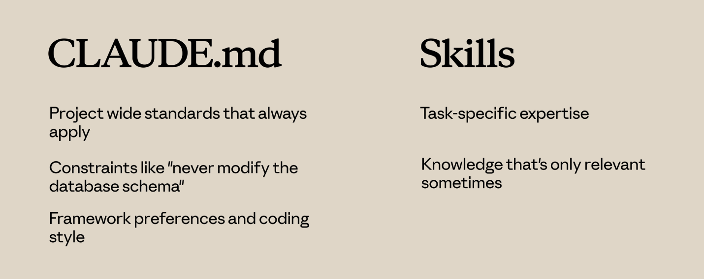

[Introduction to agent skills](https://anthropic.skilljar.com/introduction-to-agent-skills)

## Key takeaways
- SKILL.md file with a **name** and **description** in its frontmatter - mandatory metadata fields
```
---
name: pr-review
description: Reviews pull requests for code quality. Use when reviewing PRs or checking code changes.
allowed-tools: Read, Grep, Glob, Bash(git:*) --this is optional
model: sonnet --this is optional
color: blue --this is optional
context: fork --this is optional
license: Apache-2.0 --this is optional
metadata: --this is optional
	author: example-org
	version: "1.0"
---
```
  - name mentioned in SKILL.md should match the directory of the skill, in this case its `.claude/skills/pr-review/SKILL.md` (project level), or `~/.claude/skills/pr-review/SKILL.md`
  - Only frontmatter of the skill will be added to the context (name and description of the skill not full content)
  - Below the frontmatter, you write the actual instructions, it will be added to context only when skill is invoked
  - Claude uses the description to match the skills to requests, it matches using semantic search
  - Personal skills go in ```~/.claude/skills``` and follow you across all projects
  - Projects skills go in `./claude/skills` inside a repository and are shared with anyone who clones it
  - Skills load on demand -- unlike CLAUDE.md (which loads into every conversation) or slash commands (which require explicit invocation)
  - If you or team is doing repeated work then it meant for the skill
  - Use `/skills` to list down all the skills, it show all enterprise, user level, project level and plugin level skills OR you can ask `what skills are available?`
  - Skill share the context window with the conversation, if claude wants to use a skill, it will decide to load the contents of that skill into context

### Skills Priority when name is same
1.  Enterprise (managed-settings.json)
2. Personal/user (`~/.claude/skills`)
3. Project (`project/.claude/skills`)
4. Plugins (`project/.claude-plugin/plugin.json`) - lowest

**Note:** To avoid conflicts use different descriptive names. eg: instead of `pr-review` use `frontent-pr-review` `backend-pr-review`

#### Important
- To remove skills delete the directory and restart the claude code
- Skill names should be lowercase letters, numbers and hyphens only, name should start with letter character, valid: pr-review. Not valid: pr--review, -pr-review. PR-REVIEW,
- **Name** should b a Maximum of 64 characters and should match your directory name (1-64)
- **Description** should be maximum of 1024 characters (1-1024)
- Description should contain what does skill do? and when should claude use it?
- Best practice: Keep SKILL.md under 500 lines, If exceeding that consider splitting into different content

#### Additional metadata fields
- allowed-tools: Read, Grep, Glob, Bash - (claude will not ask permission for these tools and if ommitted claude will not restrict anything and it follows normal permission model)
- model: sonnet
- color: blue
- context: fork

## Progressive disclosure
- assets: images, templates, other data files that would be relevant for that skill
- references: additional documentation
- scripts: executable files, utility files
- additonal files/directories can be created 

**Note:** To load only when necessary to load, mention like this in SKILL.md

Example
	
```
**Only load when user requests more detail.** see \[architecture-guide.md](references/architecture-guide.md)
```

```
**Only load when user requests a specific topic.** \[deep-dive-guide.md](references/deep-dive-guide.md)
```

## Bundling utility scripts
- Scripts in skill directory can run without loading their contents into context
- The scripts executes and only the output consumes the tokens
- Tell claude to run the script, not to read it. eg: Run the setup check script
- Running script is very useful for environment validation, data transformations that need to be consistent, operations that are more reliable as tested code than generated code

## CLAUDE.md vs Skills



- Claude.md loads into every conversation, always.
- Skills load on demand

**Use CLAUDE.md for:**

- Project-wide standards that always apply
- Constraints like "never modify the database schema"
- Framework preferences and coding style

**Use Skills for:**

- Task-specific expertise
- Knowledge that's only relevant sometimes
- Detailed procedures that would clutter every conversation

## Skills vs Subagents

Skills add knowledge to your current conversation. When a skill activates, its instructions join the existing context.

Subagents run in a separate context. They receive a task, work on it independently, and return results. They're isolated from the main conversation.

**Use Subagents when:**

- You want to delegate a task to a separate execution context
- You need different tool access than the main conversation
- You want isolation between delegated work and your main context

**Use Skills when:**

- You want to enhance Claude's knowledge for the current task
- The expertise applies throughout a conversation

## Skills vs Hooks

Hooks fire on events. A hook might run a linter every time Claude saves a file, or validate input before certain tool calls. They're event-driven.

Skills are request-driven. They activate based on what you're asking.

**Use Hooks for:**

- Operations that should run on every file save
- Validation before specific tool calls
- Automated side effects of Claude's actions

**Use Skills for:**

- Knowledge that informs how Claude handles requests
- Guidelines that affect Claude's reasoning

## Putting It All Together

A typical setup might include:

- **CLAUDE.md** — always-on project standards
- **Skills** — task-specific expertise that loads on demand
- **Hooks** — automated operations triggered by events
- **Subagents** — isolated execution contexts for delegated work
- **MCP servers** — external tools and integrations

## Sharing skills
- Share through version control, committing skill to repository `./claude/skills`
- Plugin distribution - .claude-plugin and same level skills/pr-review/SKILL.md
- Enterprise deployment - Administrators can deploy skills organizationwide through `managed-settings.json`
- ```json
  "strictKnownMarketPlaces": [
	  {
		  "source": "github",
		  "repo": "acme-corp/approved-plugins"
	  },
	  {
		  "source": "npm",
		  "package": "@acme-corp/compliance-plugins"
	  }
  ]
  ```

## Sharing to subagents
- sub agents don't automatically see your skills
- when we delegate a task to a sub agent, it starts with a fresh, clean context.
- Built-in agents like Explorer, Plan and Verify can't access skills at all. Only custom sub agents we define can use them and only when we explicitly list them.

`.claude/agents/frontend-security-accessibility-reviewer.md`
```json
name: frontend-security-accessibility-reviewer
description: "use this agent when you need to review frontend code"
tools: Bash, Glob, Grep, Read, WebFetch, WebSearch, Skill
model: sonnet
color: blue
skills: accessibility-audit
```

**Important:**
- These skills are loaded when the sub agent starts, not in a demand like in the main conversation
- make sure that skill exists in `./claude/skills/accessibility-audit/SKILL.md`
- If already agent exists, add `skills: accessibility-audit` agent's frontmatter
- OR create new one
	- Use `/agents` to create new agent
	- Provide what create. eg: `I want you to review the frontend for any issues with accessibility, errors and security issues.`

- Use this prompt to trigger the sub agent with skill: `Please use @"frontend-security-accessibility-reviewer (agent)" to review my frontend code`

## When to use Skills with subagents
- When want isolated task delegation with specific expertise.
- Different subagents need different skills, like Front-end reviewer vs Backend-reviewer

## Troubleshooting skills
### Agent Skills Verifier
- skills-ref: https://github.com/agentskills/agentskills
- `cd agentskills/skills-ref`
- `uv sync`
- `source .venv/bin/activate`
- `skills-ref validate <to-skill-directory>` 
- eg: `skills-ref validate /Users/lakkanna/projects/goc/.claude/skills/audit`

- ![[skill-validate-print.png]]

### Skills aren't triggering
- skill exists, and it passes the validator but Claude isn't using it when expected
- Reason: Check the description and add the trigger phrases users would use
- User prompts eg: 
	- Test with variations
	- Help me profile this
	- Why is this slow?
	- Make this faster
- If any fail to trigger, add those keywords to description

### Skills aren't loading
- If skill doesn't appear when ask Claude: what skills are available? 

**Check these:**
- Skill must be in right location with right structure
- SKILL.md must be inside of a named directory not at a skills root directory. eg: `./claude/skills/pr-review/SKILL.md`
- File name must be exactly SKILL.md
- Use `claude --debug` to see loading errors, look for messages mentioning skill name

### Multiple Skills conflict
- Probably skills description is too similar compared to other one, make them distinct

### Priority shadowing
- Looks for the skills in Enterprise, Personal, Project and Plugins, order matter here so Enterprise is the highest one here
- Having different skill name would solve it

### Plugin Skills aren't appearing
- Clear the cache: `rm ./claude/plugins/cache`
- Restart Claude code and re-install

### Runtime errors
- Skill loads but fails during execution
- If skill uses external packages, they must be installed. Add this info to description
- Scripts need execute permissions
- Use `chmod +x .\check-setup.py`

### Quick diagnostic checklist
- Not triggering - check the description and specific description with trigger phrases
- Not loading - check the skill path, name and the directory name is same or not and YAML syntax
- Wrong skill loaded - make description more distinct
- Is skill being shadowed - Check the priority and rename if needed
- Plugins missing - clear the cache, restart claude and re-install the plugin
- Runtime failure - check the external packages are installed or not, mention usage of external packages in description and make scripts executable
- 